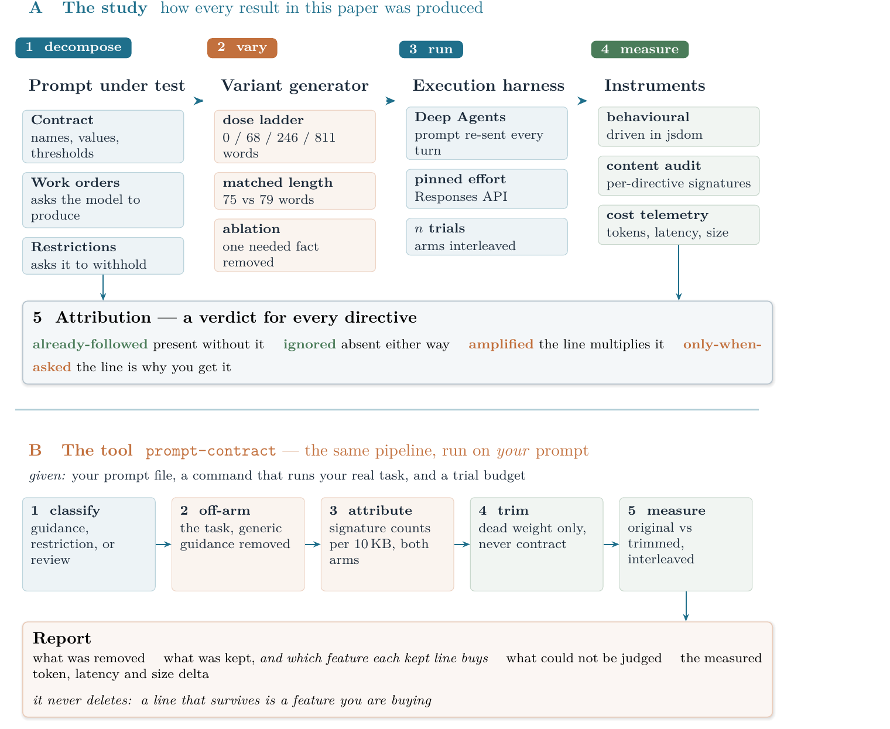

# Instruction Economics in Agent System Prompts

**Every generic line in a system prompt is a work order, not a reminder — and
you are billed for it at the output.**

Agent system prompts grow. A `CLAUDE.md`, an `AGENTS.md`, a packaged skill — they
accumulate general engineering advice (*write semantic markup, handle the empty
case, name your constants*) next to the project-specific facts a model cannot
possibly guess. Everyone has an opinion about that general half. One camp calls
it harmless insurance. The other calls it bloat that makes the model worse.

We measured it, across **198 runs** on two frontier models. Both camps are wrong,
in useful ways:

- **It is not redundant.** The model does not do those things unprompted. A
  `prefers-reduced-motion` query appears in **0 of 12** generated files when
  unmentioned and **12 of 12** when asked for.
- **It is not free.** 811 words of guidance cost **+42% output tokens** and
  **+38% latency** — and 73% of that lands on the output side, where prompt
  caching cannot help you.
- **It does not make the model worse.** Correctness held at ceiling on three
  increasingly demanding instruments.

So a generic line is doing exactly one of three things, and **you cannot tell
which by reading it**: the model already does it anyway, the model ignores it
anyway, or that line is the only reason you get the behaviour at all. The first
two are dead weight. The third is a feature you are buying.

This repository contains the measurements — and a tool that runs the same
procedure against *your* prompt.



---

## The tool: `prompt-contract`

An installable agent skill. Point it at a prompt and a command that runs your
real task, and it tells you which lines to cut and what cutting them saves.

It **never deletes anything itself**. A line that survives is a feature you are
buying, and whether to keep buying it is your call, not a tool's.

### Install

**Claude Code — for one project:**

```bash
git clone --depth 1 https://github.com/JashwanthY/instruction-economics /tmp/ie
mkdir -p .claude/skills
cp -r /tmp/ie/skills/prompt-contract .claude/skills/
```

**Claude Code — for every project:**

```bash
git clone --depth 1 https://github.com/JashwanthY/instruction-economics /tmp/ie
mkdir -p ~/.claude/skills
cp -r /tmp/ie/skills/prompt-contract ~/.claude/skills/
```

Restart Claude Code, then ask in plain language:

> *"My CLAUDE.md is getting long — which lines are actually doing anything?"*

The skill triggers on that kind of request and walks the procedure itself.

**Any other agent.** `SKILL.md` is plain Markdown with YAML frontmatter, and the
two scripts are dependency-free Python. Point your agent at
`skills/prompt-contract/SKILL.md` and it can follow the steps — nothing in it is
specific to Claude Code.

### Use it without an agent

```bash
# free: classify every line of a prompt
python3 skills/prompt-contract/scripts/audit.py classify path/to/your/SKILL.md

# after running your task with the generic guidance removed:
python3 skills/prompt-contract/scripts/audit.py report path/to/your/SKILL.md \
    --off 'runs/off_*.html' --on 'runs/on_*.html'

# measure what a trim actually saved
python3 skills/prompt-contract/scripts/measure.py --cmd './run.sh' \
    --variant original=prompt.md --variant trimmed=trimmed.md --runs 3
```

`measure.py` shells out to a command you supply, so it works with any model, any
harness, any language.

---

## What the study found

| | |
|---|---|
| **Guidance is a purchase order** | 811 words → +42% output tokens, +38% latency; 73% of the added spend on the uncacheable side |
| **Length is the wrong variable** | at matched length, 75 words asking the model to *do* cost +22%; 79 words asking it to *withhold* saved **31%** |
| **Skill scale behaves differently** | 4,746 added words that mostly *describe* rather than *request* cost only +4% |
| **Correctness held** | on a pipeline whose positive control drops 26 points when one needed parameter is removed |

Full detail, method and limitations: [`paper-bloat/main.pdf`](paper-bloat/main.pdf).

## Verify it yourself

```bash
pip install -r requirements.txt
npm install jsdom                      # the behavioural graders run in Node
python3 experiments/verify_paper.py    # offline; no API key, no model call
```

`verify_paper.py` recomputes every numeric claim in the paper from the raw run
logs and exits non-zero on any mismatch. The complete logs of all 198 runs are in
[`experiments/`](experiments/), which is what makes the paper checkable rather
than merely readable.

Re-running the experiments themselves needs `OPENAI_API_KEY`, or
`OPENAI_ENV_FILE` pointing at a `.env` containing one. API nondeterminism means
fresh runs differ in detail; the shipped logs are the record.

## Licence

Code MIT, paper and figures CC BY 4.0. See [LICENSE](LICENSE) and
[CITATION.cff](CITATION.cff).
